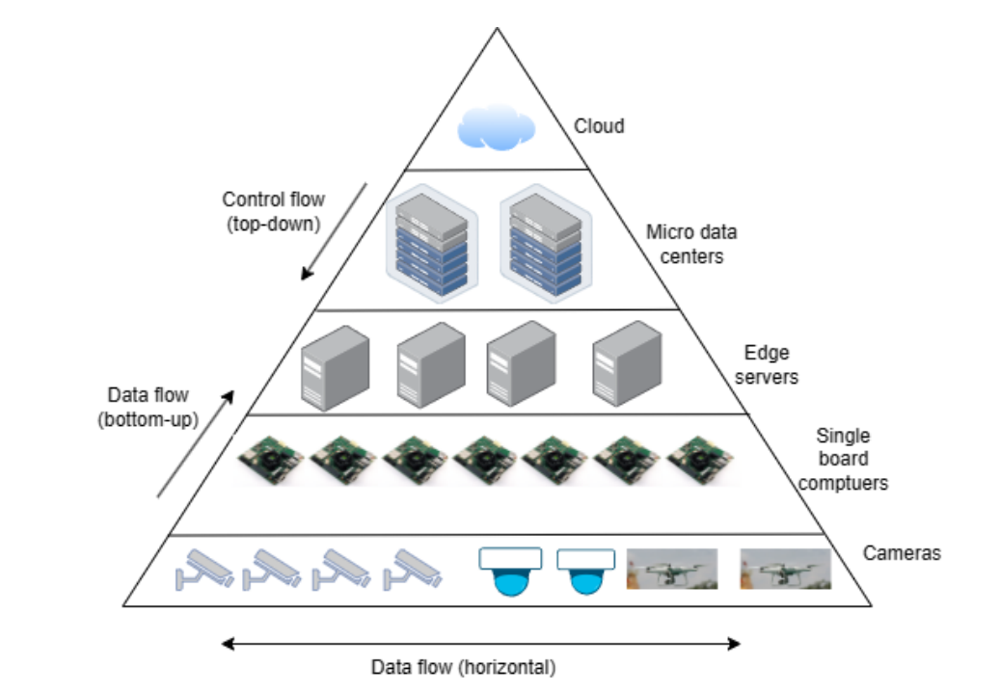

# Camera-Installation-to-flood-inundation-sensors-with-NOAA
Camera Installation to flood inundation sensors with NOAA

## Comments
    - Hellium network is not suitable for video stram but still considerable if the FPS will be so low
    
## Type of Camera
    - FPS ???
    - Resolution
    - Night Vision ???
    - Stream method
#### Low cost-Low Power-Low Resolution

#### Security Cameras

#### PTZ

## IoT Video Streaming Architecture

1. **IoT Devices:**
   - These are the devices equipped with cameras or sensors to capture video data. Examples include surveillance cameras, smart cameras, or sensors with video capabilities.

2. **Edge Devices:**
   - Intermediate devices located closer to the IoT devices for initial processing of video data. This can involve preprocessing, filtering, or compression to reduce the data size before transmission.

3. **Gateway:**
   - The gateway aggregates data from multiple edge devices and sends it to the central server. It may perform additional processing and act as a bridge between edge devices and the central server.

4. **Central Server or Cloud:**
   - This is where the main processing and storage of video data occur. Cloud-based services are commonly used for scalability and accessibility. Advanced analytics, storage, and management take place here.

5. **User Interface:**
   - Applications or interfaces that allow users to view, control, and interact with the video streams. This could be a web interface, mobile app, or other visualization tools.

## Streaming Protocols
    - WebRTC
    - RTSP
    - HLS

1. **Real-Time Streaming Protocol (RTSP):**
   - A standard protocol used for establishing and controlling media sessions between endpoints. It's commonly used for live streaming and supports various video and audio formats.

2. **Hypertext Transfer Protocol (HTTP):**
   - HTTP-based streaming protocols, like HTTP Live Streaming (HLS) and Dynamic Adaptive Streaming over HTTP (DASH), are widely used for adaptive bitrate streaming. They allow adjusting the quality based on network conditions.

3. **WebRTC (Web Real-Time Communication):**
   - A free, open-source project that enables real-time communication between web browsers, mobile applications, and IoT devices via simple application programming interfaces (APIs). It is suitable for low-latency applications.

4. **MQTT (Message Queuing Telemetry Transport):**
   - A lightweight messaging protocol suitable for IoT applications. While not specifically designed for video streaming, it can be used for transmitting video-related data and commands between devices.

5. **CoAP (Constrained Application Protocol):**
   - Designed for resource-constrained devices and networks. It's suitable for IoT scenarios where devices may have limited resources.

Choosing the right protocol depends on factors like latency requirements, bandwidth constraints, and the nature of the IoT application.

    - https://developer.tuya.com/en/iot-video-live-stream?_source=27a82e932e7eef2e999cd6f7c925541d&bd_vid=8634295905315177986
    - https://www.mdpi.com/2624-831X/4/4/21

## Cost Estimate

## Sample Studies and Related Works
#### Studies

#### Url's
- https://www.cnx-software.com/2024/01/19/16-grove-vision-ai-v2-module-features-wiseeye2-hx6538-arm-cortex-m55-ethos-u55-ai-microcontroller/
- https://www.cnx-software.com/2022/10/31/tinyml-cam-pipeline-esp32-fast-image-recognition/
- https://www.hackster.io/limengdu0117/2024-mcu-ai-vision-boards-performance-comparison-998505
- https://www.arducam.com/product/rp2040-based-arducam-pico4ml-dev-board-for-machine-vision/
- https://github.com/bharathsudharsan/TinyML-CAM
- https://www.tenevia.com/en/sensor/cam-level-water-level-measurement-by-camera/#:~:text=CamLevel%20operates%20with%20a%20conventional,in%20the%20near%20infrared%20spectrum
- https://www.abc4.com/news/wasatch-front/mobile-cameras-installed-along-utah-rivers-and-streams-to-monitor-water-levels/
- https://www.arducam.com/product/hm01b0-qvga-monochrome-dvp-camera-module-for-arduino-giga-r1-wifi-board/
- https://www.youtube.com/watch?v=fWxw7mcvguo
- https://www.youtube.com/watch?v=MKiITEsOwRA
- https://ciroh.ua.edu/research-projects/leveraging-usgs-hydrologic-imagery-visualization-and-information-system-hivis-for-an-operational-monitoring-of-streamflow-using-computer-vision/
- https://www.stevens.edu/news/temimi-and-liu-awarded-usd870-614-united-states-geological-survey-grant-to
- https://www.smartlagoon.eu/2023/11/20/bodoque-an-energy-efficient-flow-monitoring-system-for-ephemeral-streams/
- https://webcoos.org/
- https://collaboratory.unc.edu/wp-content/uploads/sites/476/2021/04/flood-resiliency-data-collection-and-data-analytic-in-support-of-flood-management.pdf
- https://sunnydayflood.apps.cloudapps.unc.edu/
- https://lbfoster.com/rail/total-track-monitoring/flood-monitoring
- https://www.cbs17.com/news/north-carolina-news/ncdot-early-flood-warning-system-up-for-national-award/

