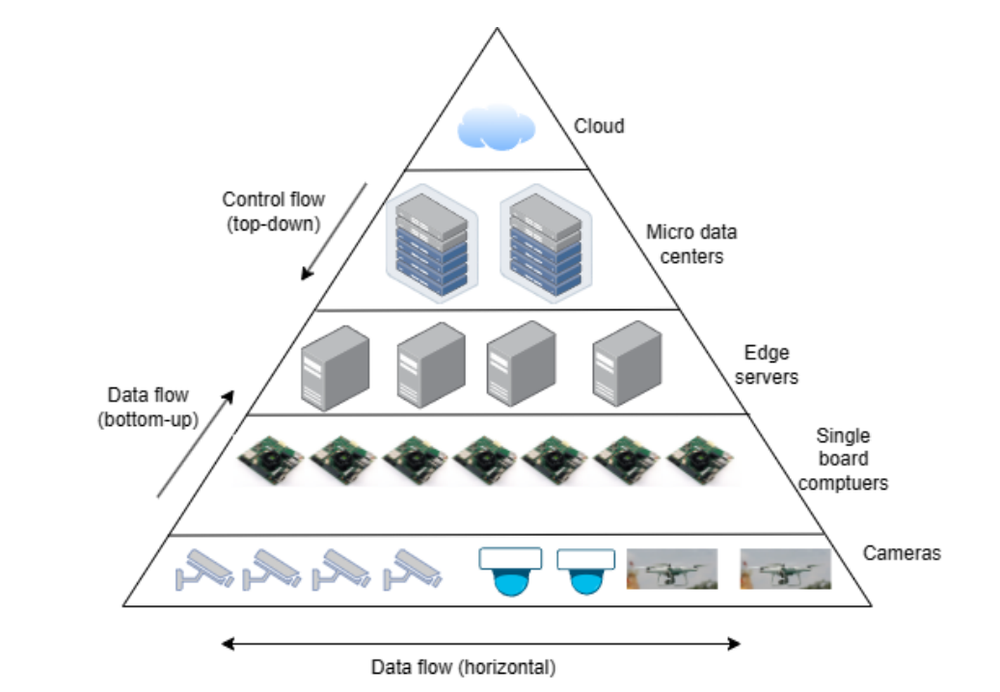

"# Instruments-for-CIROH" 

# Submersible Water Level and Ice Thickness Monitoring Sensor Prototype

## Overview

This repository contains the development and testing of a prototype for novel observation sensors designed to continuously measure changes in water level using pressure loggers. The goal is to collect observations in real-time and facilitate the monitoring of water levels.

## Components

### 1. Submersible Sensor Unit

The submersible sensor unit consists of the following components:

| Component Name                                                                                                                                                             | Quantity | Description                                                              | Unit Price (USD)                                                                                                                                            | Total Cost (USD)                                                                                                                                             |
|----------------------------------------------------------------------------------------------------------------------------------------------------------------------------|----------|--------------------------------------------------------------------------|-------------------------------------------------------------------------------------------------------------------------------------------------------------|--------------------------------------------------------------------------------------------------------------------------------------------------------------|
| [Submersible Water Level Sensor](submersiblePressureSensors.md)                                                                                                            | 1        | Measures water pressure at specific depth                                | [$720](submersiblePressureSensors.md#L9)                                                                                                                    | [$720](submersiblePressureSensors.md#L9)                                                                                                                     |
| [Ice Thickness Probe](IceThicknessProbe.md)                                                                                                                                | 1        | Custom Design                                                            | [$350](IceThicknessProbe.md#L18)                                                                                                                            | [$350](IceThicknessProbe.md#L18)                                                                                                                             |
| [Temperature Sensor](https://www.adafruit.com/product/381?gad_source=1&gclid=Cj0KCQiAh8OtBhCQARIsAIkWb6_lTUc8ztyeZamatZAXVRI20XArqzOcbzk4sCRzwDLYhH72p3-LqV8aAjV1EALw_wcB) | 15       | WaterProof Temperature Sensor to calculate signal propagation underwater | [$10](https://www.adafruit.com/product/381?gad_source=1&gclid=Cj0KCQiAh8OtBhCQARIsAIkWb6_lTUc8ztyeZamatZAXVRI20XArqzOcbzk4sCRzwDLYhH72p3-LqV8aAjV1EALw_wcB) | [$150](https://www.adafruit.com/product/381?gad_source=1&gclid=Cj0KCQiAh8OtBhCQARIsAIkWb6_lTUc8ztyeZamatZAXVRI20XArqzOcbzk4sCRzwDLYhH72p3-LqV8aAjV1EALw_wcB) |

- [Skimmer](https://www.lowrance.com/lowrance/type/sonar-transducers/hst-wsbl/)

### 2. Real-time Data Transfer Unit

To enable real-time data transfer, a communication module is integrated into the system. This includes:

| Component Name                                 | Quantity | Description                                                        | Unit Price (USD) | Total Cost (USD) |
|------------------------------------------------|----------|--------------------------------------------------------------------|------------------|------------------|
| [Communication Module](communicationModule.md) | 1        | Enables real-time data transmission                                | $40              | $40              |
| [Power Supply](powerSupply.md)                 | 1        | Provides power to sensors and data logger and communication module | $70              | $70              |

### 3. Additional Components

| Component Name                                                                                                                                                                                                                                                                               | Quantity | Description                                                 | Unit Price (USD) | Total Cost (USD) |
|----------------------------------------------------------------------------------------------------------------------------------------------------------------------------------------------------------------------------------------------------------------------------------------------|----------|-------------------------------------------------------------|------------------|------------------|
| [Enclosure/Protection]                                                                                                                                                                                                                                                                       | 2        | Waterproof housing for sensors and logger (stainless steel) | $25              | $50              |
| [Mounting Hardware]                                                                                                                                                                                                                                                                          | 1        | Hardware to secure sensors in place                         | $40              | $40              |
| [Cables and Connectors](https://www.wireandcableyourway.com/submersible-pump-cable)                                                                                                                                                                                                          | 1        | Connects sensors to data logger                             | $30              | $30              |
| [Calibration Equipment](https://catalog.marquestscientific.com/item/solators-mini-tuff-guard-2-economy-gauge-installed/mini-tuff-gauge-isolator-2-economy-gauge-installed/mtg-22200s-pvc?gclid=Cj0KCQiA2KitBhCIARIsAPPMEhKZ0o6HKaEeIxSrRTRwFAI5jHU1AIoItZRNbcVqwtJxx7sKXvmgxLMaArjzEALw_wcB) | 1        | Instruments for sensor calibration                          | $50              | $50              |
| Software                                                                                                                                                                                                                                                                                     | 1        | Software for configuration and data analysis                | Included         | Included         |

## Estimated Total Cost 

 ### Total cost estimated between 

| Total Estimated Rough Cost                        | Cost per Instrument             |
|---------------------------------------------------|---------------------------------|
| [Instrument #1 (Ice Thickness)](README.md#L16)    | <strong>$500  </strong>         |
| [Instrument #2 (Water Level)](README.md#L16)      | <strong> $800 - $2000 </strong> |                                                                                                                                                                                                                                                                                                                                                                                                                                                                                                                                                                                                                   
| [Instrument #1 and Instrument #2)](README.md#L16) | <strong>$1300 - $2500</strong>  |
## Comments:
- The submersible pressure sensor is crucial for accurately measuring water pressure at various depths.
- Consider selecting a temperature sensor with suitable precision for accurate water temperature measurements.
- The data logger plays a key role in recording and storing data; ensure compatibility with the selected sensors.
- In Spyros Beltaos' paper, the RBR TD-1050 or RBR TD-2050 sensors mentioned are no longer in production. Instead, it is possible to use RBR's new sensors. However, I have not yet been able to obtain the exact prices of these sensors. I will attempt to contact the company to obtain a price. There are also several alternative sensors available that can be used in place of RBR, ready for use. I have tried to list their features and prices, and you can find this list above.
- Certainly, the cost for a measurement system is not only the sensor itself but also includes other equipment that might be needed to set up a system. I have tried to compile a list of the equipment I think may be required for a setup, along with their approximate costs. You can find this list above.

## Sample Studies

- https://doi.org/10.1016/j.coldregions.2011.03.005 
- https://www.ncbi.nlm.nih.gov/pmc/articles/PMC8706819/
- https://journals.ametsoc.org/view/journals/atot/36/4/jtech-d-18-0214.1.xml
- https://iopscience.iop.org/article/10.1088/0964-1726/17/4/045023
- https://conservancy.umn.edu/bitstream/handle/11299/108651/pr322.pdf?sequence=1
- https://www.mdpi.com/2073-4441/13/21/3139

# Camera Installation to flood inundation sensors
Camera Installation to flood inundation sensors with NOAA

## Comments
    - Hellium network is not suitable for video stram but still considerable if the FPS will be so low
    
## Type of Camera
    - FPS ???
    - Resolution
    - Night Vision ???
    - Stream method
#### Low cost - Low Power - Low Resolution

#### Security Cameras

#### PTZ

## IoT Video Streaming Architecture

1. **IoT Devices:**
   - These are the devices equipped with cameras or sensors to capture video data. Examples include surveillance cameras, smart cameras, or sensors with video capabilities.

2. **Edge Devices:**
   - Intermediate devices located closer to the IoT devices for initial processing of video data. This can involve preprocessing, filtering, or compression to reduce the data size before transmission.

3. **Gateway:**
   - The gateway aggregates data from multiple edge devices and sends it to the central server. It may perform additional processing and act as a bridge between edge devices and the central server.

4. **Central Server or Cloud:**
   - This is where the main processing and storage of video data occur. Cloud-based services are commonly used for scalability and accessibility. Advanced analytics, storage, and management take place here.

5. **User Interface:**
   - Applications or interfaces that allow users to view, control, and interact with the video streams. This could be a web interface, mobile app, or other visualization tools.

## Streaming Protocols
    - WebRTC
    - RTSP
    - HLS

1. **Real-Time Streaming Protocol (RTSP):**
   - A standard protocol used for establishing and controlling media sessions between endpoints. It's commonly used for live streaming and supports various video and audio formats.

2. **Hypertext Transfer Protocol (HTTP):**
   - HTTP-based streaming protocols, like HTTP Live Streaming (HLS) and Dynamic Adaptive Streaming over HTTP (DASH), are widely used for adaptive bitrate streaming. They allow adjusting the quality based on network conditions.

3. **WebRTC (Web Real-Time Communication):**
   - A free, open-source project that enables real-time communication between web browsers, mobile applications, and IoT devices via simple application programming interfaces (APIs). It is suitable for low-latency applications.

4. **MQTT (Message Queuing Telemetry Transport):**
   - A lightweight messaging protocol suitable for IoT applications. While not specifically designed for video streaming, it can be used for transmitting video-related data and commands between devices.

5. **CoAP (Constrained Application Protocol):**
   - Designed for resource-constrained devices and networks. It's suitable for IoT scenarios where devices may have limited resources.

Choosing the right protocol depends on factors like latency requirements, bandwidth constraints, and the nature of the IoT application.

    - https://developer.tuya.com/en/iot-video-live-stream?_source=27a82e932e7eef2e999cd6f7c925541d&bd_vid=8634295905315177986
    - https://www.mdpi.com/2624-831X/4/4/21

## Cost Estimate

## Sample Studies and Related Works
#### Studies

#### Url's
- https://www.cnx-software.com/2024/01/19/16-grove-vision-ai-v2-module-features-wiseeye2-hx6538-arm-cortex-m55-ethos-u55-ai-microcontroller/
- https://www.cnx-software.com/2022/10/31/tinyml-cam-pipeline-esp32-fast-image-recognition/
- https://www.hackster.io/limengdu0117/2024-mcu-ai-vision-boards-performance-comparison-998505
- https://www.arducam.com/product/rp2040-based-arducam-pico4ml-dev-board-for-machine-vision/
- https://github.com/bharathsudharsan/TinyML-CAM
- https://www.tenevia.com/en/sensor/cam-level-water-level-measurement-by-camera/#:~:text=CamLevel%20operates%20with%20a%20conventional,in%20the%20near%20infrared%20spectrum
- https://www.abc4.com/news/wasatch-front/mobile-cameras-installed-along-utah-rivers-and-streams-to-monitor-water-levels/
- https://www.arducam.com/product/hm01b0-qvga-monochrome-dvp-camera-module-for-arduino-giga-r1-wifi-board/
- https://www.youtube.com/watch?v=fWxw7mcvguo
- https://www.youtube.com/watch?v=MKiITEsOwRA
- https://ciroh.ua.edu/research-projects/leveraging-usgs-hydrologic-imagery-visualization-and-information-system-hivis-for-an-operational-monitoring-of-streamflow-using-computer-vision/
- https://www.stevens.edu/news/temimi-and-liu-awarded-usd870-614-united-states-geological-survey-grant-to
- https://www.smartlagoon.eu/2023/11/20/bodoque-an-energy-efficient-flow-monitoring-system-for-ephemeral-streams/
- https://webcoos.org/
- https://collaboratory.unc.edu/wp-content/uploads/sites/476/2021/04/flood-resiliency-data-collection-and-data-analytic-in-support-of-flood-management.pdf
- https://sunnydayflood.apps.cloudapps.unc.edu/
- https://lbfoster.com/rail/total-track-monitoring/flood-monitoring
- https://www.cbs17.com/news/north-carolina-news/ncdot-early-flood-warning-system-up-for-national-award/

